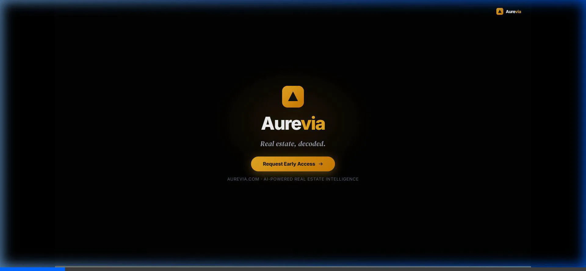

<div align="center">


<br/><br/>

# Aurevia — Real Estate Intelligence Platform

### *Real estate, decoded.*

**Aurevia is an AI-powered real estate intelligence platform** that helps investors and buyers discover, analyze, and transact properties smarter — through AI-driven personalization, live market analytics, and automated investment scoring.

</div>

---

<div align="center">

## 🎬 Live Product Demo

> ▶️ **Animated preview auto-plays below** — click to open the full interactive HTML demo

<a href="demo.html" title="Watch the Aurevia Product Demo — 16:9 Landscape">
  
</a>

<sub>⬆️ <em>Animated WebP auto-plays &middot; Click the image to open the interactive demo with ambient soundtrack</em></sub>

<br/>

<table>
<tr>
<td align="center" width="50%">

**📱 Mobile &amp; Social Cutdown (9:16)**

<a href="demo_9x16.html" title="Vertical Mobile Demo">
  
</a>

<sub><em>Vertical format &middot; Click for interactive version</em></sub>

</td>
<td align="center" width="50%">

**🌐 Platform Landing Page**

<a href="index.html" title="Aurevia Platform Landing Page">
  
</a>

<sub><em>Open <code>index.html</code> for the full premium UI</em></sub>

</td>
</tr>
</table>

</div>

---

<div align="center">

## ✨ Platform Stats

| 🏘️ Properties Analyzed | ⚡ Faster Decisions | 🎯 Match Satisfaction | 💰 Transaction Volume |
|:---:|:---:|:---:|:---:|
| **10,000+** | **3.5×** | **98%** | **$4.2B** |

</div>

---

## ⚡ Platform Features

### 🤖 AI Search & Match Engine
Natural language property search with a **multi-dimensional match scoring algorithm**. Each property receives a personalized match score based on target yield, risk tolerance, and appreciation potential — ranked dynamically in real time.

### 📊 Market Analytics Layer
**Real-time price appreciation tracking** across top investment markets (Austin, Miami, NYC, Denver, Nashville). Neighborhood demand heatmaps and macro market trend comparisons help you spot the next high-yield opportunity before the crowd.

### 📈 Investment Scorecard
Automated **ROI calculations (IRR)**, cap rate breakdown, gross vs. net yield comparisons, and a proprietary **100-point Risk Score** — all generated instantly for any property.

### 🔄 Guided Deal Pipeline
A streamlined digital transaction pipeline covering offer submission, inspection coordination, vault document e-signing, and escrow tracking. From discovery to closing in one unified flow.

---

## 📽️ Demo Scene Breakdown

| Timestamp | Scene | Description |
| :---: | :--- | :--- |
| **0:00–0:05** | **Logo Reveal** | Deep black screen, gold Aurevia logo fades in with soft radial pulse glow. Tagline types out with cursor. |
| **0:05–0:12** | **Problem Framing** | Rapid-cut sequence of cluttered listing pages fading to black. *"Endless listings. No real answers."* |
| **0:12–0:20** | **Product Reveal** | Dashboard slides up with spring motion. AI search bar animates a natural-language query. Property cards slide in with AI match % badges. |
| **0:20–0:27** | **Personalized Matches** | 4-card grid filters and reorders dynamically. Match score bars fill: 96% &middot; 89% &middot; 82% &middot; 84%. |
| **0:27–0:33** | **Market Insights** | Gold SVG price-appreciation curve draws itself live across 2020–2025 timeline. Neighborhood heatmap cells animate. |
| **0:33–0:40** | **Investment Analysis** | ROI counter 24.7%, Cap Rate 8.4%, Risk Score 14/100 — all count up with performance gauges filling. |
| **0:40–0:46** | **Deal Pipeline** | 5-step transaction pipeline (Offer → Inspection → Documents → Escrow → Closing) with animated green checkmarks. |
| **0:46–0:52** | **Social Proof** | Bold stat counters zoom in: 10,000+ properties &middot; 3.5× faster &middot; 98% satisfaction &middot; $4.2B volume. SOC 2 & GDPR badges. |
| **0:52–0:57** | **Closing CTA** | Aurevia hero logo returns with gold radial glow aura. *"Request Early Access →"* |

---

## 🎨 Brand Identity & Design System

Aurevia’s design language aims for a premium, calm, and trustworthy consumer experience, avoiding generic startup clichés.

| Element | Value |
|:---|:---|
| **Base Background** | Deep Charcoal `#09090E` / `#0F1018` |
| **Brand Accent** | Aureate Gold `#E8A820` / `#FFD160` |
| **Positive Indicator** | Mint Green `#34D399` |
| **Data Accents** | Navy Blue `#9AAEDD` &middot; Purple `#A78BFA` |
| **Headline Font** | *DM Serif Display* — editorial precision |
| **UI & Data Font** | *Inter* — clean, high-legibility sans-serif |
| **Audio (Demo)** | Custom Web Audio API 3-layer ambient synthesizer — sub bass, LFO-modulated breathing pad, high shimmer pad |

---

## 🚀 Quick Start

```bash
# 1. Clone the repository
git clone https://github.com/AshleyFullero/Aurevia.git
cd Aurevia
```

Open any of these files in a modern browser:

| File | Description |
|:---|:---|
| [`index.html`](index.html) | Full responsive platform landing page |
| [`demo.html`](demo.html) | 16:9 landscape product demo (57s) |
| [`demo_9x16.html`](demo_9x16.html) | 9:16 vertical mobile / social cutdown (55s) |

> **Demo Controls:** Press `R` to restart &middot; `Space` to pause/resume &middot; Enable audio for the procedural ambient soundtrack.

---

## 🛡️ Security & Compliance

<div align="center">


</div>

---

<div align="center">

© 2026 **Aurevia Intelligence Inc.** All rights reserved.

*Built with precision. Powered by intelligence.*

</div>
