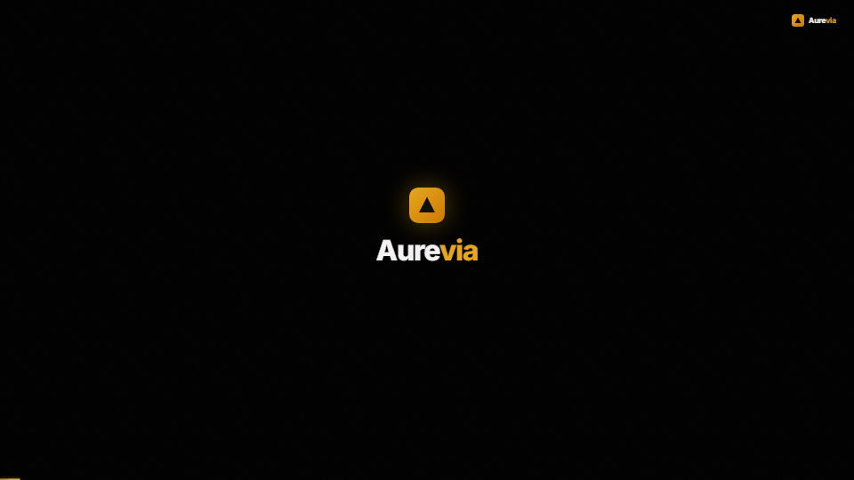

<div align="center">


<br/><br/>

# Aurevia — Real Estate Intelligence Platform

### *Real estate, decoded.*

**Aurevia is an AI-powered real estate intelligence platform** that helps investors and buyers discover, analyze, and transact properties smarter, through AI-driven personalization, live market analytics, and automated investment scoring.

<br/>

</div>

---

<div align="center">

## 🎬 Product Demo

> ▶️ **Auto-playing demo below** — 9 scenes, 57 seconds, all 9 core features

<a href="demo.html" title="Open interactive Aurevia demo with full animations + ambient soundtrack">
  
</a>

<sub>⬆️ <em>Animated GIF loops automatically · Click to open <code>demo.html</code> for the full interactive version with ambient soundtrack</em></sub>

</div>

---

<div align="center">

## ✨ Platform Stats

| 🏘️ Properties Analyzed | ⚡ Faster Decisions | 🎯 Match Satisfaction | 💰 Transaction Volume |
|:---:|:---:|:---:|:---:|
| **10,000+** | **3.5×** | **98%** | **$4.2B** |

</div>

---

## ⚡ Platform Features

### AI Search & Match Engine
Natural language property search with a **multi-dimensional match scoring algorithm**. Each property receives a personalized match score based on target yield, risk tolerance, and appreciation potential — ranked dynamically in real time.

### Market Analytics Layer
**Real-time price appreciation tracking** across top investment markets (Austin, Miami, NYC, Denver, Nashville). Neighborhood demand heatmaps and macro market trend comparisons help you spot the next high-yield opportunity before the crowd.

### Investment Scorecard
Automated **ROI calculations (IRR)**, cap rate breakdown, gross vs. net yield comparisons, and a proprietary **100-point Risk Score** — all generated instantly for any property.

### Guided Deal Pipeline
A streamlined digital transaction pipeline covering offer submission, inspection coordination, vault document e-signing, and escrow tracking. From discovery to closing in one unified flow.

### Engineering Tech Stack
A new dedicated section showcasing the full Aurevia engineering stack with an **infinite-scrolling dual-row marquee** and a **6-category grid**. Technologies include:

| Category | Technologies |
|:---|:---|
| **Languages** | Python, TypeScript, Go, Rust, JavaScript, Scala, SQL, GraphQL, R, Kotlin, Swift |
| **Frontend & Mobile** | React, Next.js, Vue.js, React Native, Expo, Three.js, Framer Motion, Vite |
| **Backend & APIs** | Node.js, FastAPI, Django, Express.js, tRPC, gRPC, REST, WebSockets |
| **AI / ML** | TensorFlow, PyTorch, OpenAI API, LangChain, Hugging Face, Scikit-learn, Pandas, NumPy |
| **Data & Databases** | PostgreSQL, Redis, MongoDB, ClickHouse, Apache Kafka, Elasticsearch, Pinecone, Snowflake |
| **Cloud & DevOps** | AWS, Google Cloud, Vercel, Docker, Kubernetes, Terraform, GitHub Actions, Datadog |

---

## Brand Identity & Design System

Aurevia’s design language aims for a premium, calm, and trustworthy consumer experience, avoiding generic startup clichés.

| Element | Value |
|:---|:---|
| **Base Background** | Deep Charcoal `#09090E` / `#0F1018` |
| **Brand Accent** | Aureate Gold `#E8A820` / `#FFD160` |
| **Positive Indicator** | Mint Green `#34D399` |
| **Data Accents** | Navy Blue `#9AAEDD` · Purple `#A78BFA` |
| **Headline Font** | *DM Serif Display* — editorial precision |
| **UI & Data Font** | *Inter* — clean, high-legibility sans-serif |
| **Audio (Demo)** | Custom Web Audio API 3-layer ambient synthesizer — sub bass, LFO-modulated breathing pad, high shimmer pad |

---

## Quick Start

```bash
# 1. Clone the repository
git clone https://github.com/AshleyFullero/Aurevia.git
cd Aurevia
```

Open any of these files in a modern browser:

| File | Description |
|:---|:---|
| [`index.html`](index.html) | Full responsive platform landing page |
| [`demo.html`](demo.html) | 16:9 landscape product demo (57s) |
| [`demo_9x16.html`](demo_9x16.html) | 9:16 vertical mobile / social cutdown (55s) |

> **Demo Controls:** Press `R` to restart · `Space` to pause/resume · Enable audio for the procedural ambient soundtrack.

---

## Security & Compliance

<div align="center">


</div>

---

<div align="center">

© 2026 **Aurevia Intelligence Inc.** All rights reserved.

*Built with precision. Powered by intelligence.*

</div>

aaaa
