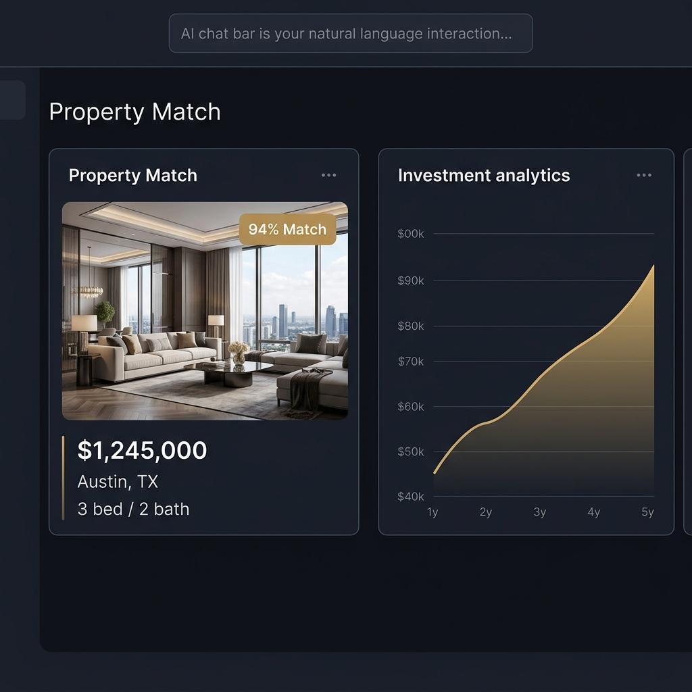

# Aurevia — Real Estate Intelligence Platform

**Real estate, decoded.**  
Aurevia is an AI-powered real estate intelligence platform that helps investors and buyers discover, analyze, and transact properties smarter through AI-driven personalization, market analytics, and investment scoring.

---

## 🎬 SaaS Product Demo Video

Aurevia's core experience is showcased in a high-fidelity, fully code-driven product demo. 

### 16:9 Landscape Launch Video (57s)

[](demo.html)

> **Note on playback**: The animated WebP above plays automatically. To experience the high-frame-rate, interactive HTML animation with its ambient soundtrack, you need to run it locally. Clone this repository and open `demo.html` in your browser.

### 📱 9:16 Vertical Mobile & Social Cutdown (55s)

[](demo_9x16.html)

*Vertical cutdown for mobile and social media. Clone and open `demo_9x16.html` locally to experience the interactive version.*

---

## 📽️ Video Shot List & Timestamp Structure

| Timestamp | Scene | Key Motion & Content | Text Overlay |
| :---: | :--- | :--- | :--- |
| **0:00–0:05** | **Logo Reveal** | Deep black screen, gold Aurevia logo fades in with soft radial pulse glow. Tagline types out with cursor. | *"Real estate, decoded."* |
| **0:05–0:12** | **Problem Framing** | Rapid cut sequence of cluttered, overwhelming listing pages with noise filter bars fading to black. | *"Endless listings. **No real answers.**"* |
| **0:12–0:20** | **Product Reveal** | Aurevia browser chrome dashboard slides up with spring motion. AI search bar animates natural typing query. Property cards slide in with AI match percentage badges. | *"AI Match Engine"* |
| **0:20–0:27** | **Personalized Matches** | 4-card grid filtering and reordering dynamically. Match score bars fill up (`96%`, `89%`, `82%`, `84%`). | *"Personalized Matches"* |
| **0:27–0:33** | **Market Insights** | Gold SVG price appreciation curve draws itself live across 2020–2025 timeline. Neighborhood demand heatmap cells animate with market comparison stats. | *"Market Insights"* |
| **0:33–0:40** | **Investment Analysis** | 3 investment panels animate up. ROI counter (`24.7%`), Cap Rate (`8.4%`), and Risk Score (`14/100`) count up with performance gauges filling. | *"Investment Scorecard"* |
| **0:40–0:46** | **End-to-End Transactions** | 5-step transaction pipeline (*Offer Made* → *Inspection* → *Documents* → *Escrow* → *Closing*) with animated green checkmarks and active deal status card. | *"End-to-End Transactions"* |
| **0:46–0:52** | **Social Proof & Stats** | Bold stat counters zoom in: `10,000+` properties analyzed, `3.5x` faster decisions, `98%` match satisfaction, `$4.2B` volume + SOC 2 & GDPR badges. | *"10,000+ Properties Analyzed"* |
| **0:52–0:57** | **Closing CTA** | Aurevia hero logo returns centered with gold radial glow aura. Interactive pill CTA button animates in. | *"Request Early Access →"* |

---

## ⚡ Platform Architecture & Features

* **AI Search & Match Engine** — Natural language property search with a multi-dimensional match scoring algorithm based on target yield, risk tolerance, and appreciation potential.
* **Market Analytics Layer** — Real-time price appreciation tracking, neighborhood heatmaps, and macro market trend comparisons (Austin, Miami, NYC, Denver, Nashville).
* **Investment Scorecard** — Automated ROI calculations (IRR), cap rate breakdown, gross vs. net yield comparisons, and 100-point risk score assessments.
* **Guided Deal Pipeline** — Streamlined digital transaction pipeline covering offer submission, inspection coordination, vault document e-signing, and escrow tracking.

---

## 🎨 Brand Identity & Design System

Aurevia's design language aims for a premium, calm, and trustworthy consumer experience, avoiding generic startup clichés.

- **Color Palette**:
  - **Base Background**: Deep Charcoal (`#09090E` / `#0F1018`)
  - **Brand Accent**: Aureate Gold (`#E8A820` / `#FFD160`)
  - **Data Indicators**: Mint Green (`#34D399`) for positive returns, Navy Blue (`#9AAEDD`), Purple (`#A78BFA`)
- **Typography**:
  - **Headlines**: *DM Serif Display* (editorial precision)
  - **Interface & Data**: *Inter* (clean sans-serif, high-legibility UI typography)
- **Audio Direction (Demo)**:
  - Custom Web Audio API procedural 3-layer ambient synthesizer score (sub bass, LFO-modulated breathing pad, high shimmer pad) paired with soft UI interaction clicks.

---

## 🚀 Quick Start / Local Setup

Because the interactive demos use local assets and precise timing, they are best viewed directly in a local browser.

1. **Clone the repository**
   ```bash
   git clone https://github.com/AshleyFullero/Aurevia.git
   cd Aurevia
   ```

2. **View Main Platform Landing Page**
   Open `index.html` in any modern web browser to see the responsive, premium UI.

3. **Run the Interactive Demo Videos (HTML)**
   - Open `demo.html` for the 16:9 landscape video.
   - Open `demo_9x16.html` for the vertical mobile video.
   - **Controls:** Press `R` to restart the video sequence, or `Space` to pause/resume playback. Make sure your browser allows audio context if you want to hear the procedural ambient soundtrack.

---

© 2026 Aurevia Intelligence Inc. All rights reserved.
